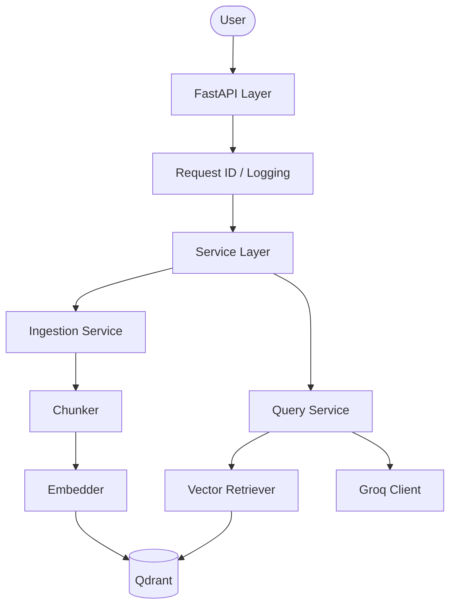

# 🛡️ DeepVault: Enterprise-Grade RAG

DeepVault is a high-performance, modular Retrieval-Augmented Generation (RAG) service designed for low-latency semantic search and AI-driven insights. It is powered by **Groq** for lightning-fast inference and **Qdrant** for robust vector retrieval.

## 🚀 Features

- **Blazing Fast Inference**: Leveraging Groq (Llama-3) for sub-second responses.
- **Enterprise Middleware**: Built-in Request ID tracking and performance logging.
- **Multi-Source Ingestion**: Native support for **Markdown**, **PDF**, and **Plain Text**.
- **Observability**: Structured JSON logging for production-grade monitoring.
- **Developer-First**: Fully typed Python, modular architecture, and comprehensive CI pipeline.

## 🛠️ Technical Stack

- **Framework**: FastAPI
- **LLM Provider**: Groq
- **Embedding**: BGE-Small-v1.5 (Local Sentence-Transformers)
- **Vector DB**: Qdrant
- **Metadata DB**: SQLite
- **Environment**: UV (Python 3.13)

## 🏗️ Architecture



## ⚙️ Quick Start

### 1. Prerequisites
- [uv](https://github.com/astral-sh/uv) installed.
- [Groq API Key](https://console.groq.com/).

### 2. Installation
```powershell
# Clone the repository
git clone https://github.com/ManvendraPratapRao/deepvault.git
cd deepvault

# Setup environment
cp .env.example .env  # Add your GROQ_API_KEY
uv sync
```

### 3. Run the Server
```powershell
$env:PYTHONPATH="."; uv run python main.py
```

Visit `http://localhost:8000/docs` to see the interactive documentation.

## 🧪 Development

```bash
# Run Unit Tests
uv run pytest

# Lint and Type Check
uv run ruff check .
uv run mypy .
```

---
