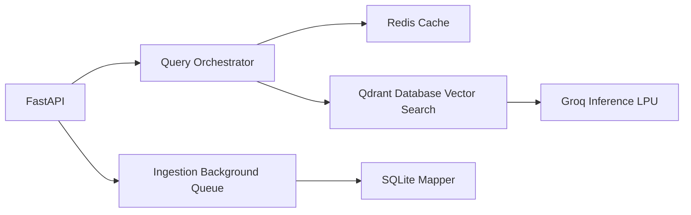

# DeepVault Enterprise RAG 🔥

DeepVault is an ultra-fast, Enterprise-grade Retrieval-Augmented Generation (RAG) platform uniquely constructed from the ground-up strictly utilizing Interface-Driven Domain Driven Design. It features a complete asynchronous processing architecture mathematically mapping external document integrations seamlessly.

## Tech Stack 🚀

- **Core Array**: FastAPI (Python 3.13) statically executed over `astral-sh/uv` structures.
- **RAG Generation**: Groq Llama-3.1 LPU Inferencing.
- **Semantic Caching**: Redis 7 Cache Engine mapping hash queries across identical transactions natively.
- **Vector Networking**: Local Qdrant Engine (HTTP networked dynamically directly towards Docker networks natively).
- **Core Persistence**: SQLite State Arrays mapping duplicate constraints natively.
- **Embedding Compute**: BAAI `bge-small-en-v1.5` executing deeply dynamically inside the container CPU.

## System Architecture

DeepVault is explicitly cleanly modeled executing standard Hexagonal orchestrations decoupling business intelligence strictly behind abstract network interfaces gracefully:



## Quick Start 🎯

Boot up the entire dynamic Enterprise architecture completely natively in 3 commands locally automatically.

### 1. Launch the Swarm Node
Start the exact microservices dynamically deploying Qdrant and Redis concurrently in exactly detached layers:
```bash
make docker-up
```

### 2. Populate the Network
Recursively push native dynamic local array datasets completely evaluating all PDFs/Markdown documents asynchronously computationally directly dynamically into vectors instantly:
```bash
make seed
```

### 3. Access The Pipeline
Mechanically ping the network instantly to verify latency networks completely automatically:
```bash
curl -X POST "http://localhost:8000/api/v1/query" \
     -H "Content-Type: application/json" \
     -d '{"query_text": "What does DeepVault actually do?", "top_k": 3}'
```
