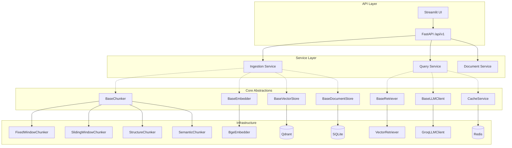

# DeepVault — Enterprise RAG Platform

DeepVault is a production-grade Retrieval-Augmented Generation (RAG) system built from scratch using interface-driven design. It ingests enterprise documents (Markdown, text, PDF), chunks them using 4 configurable strategies, stores embeddings in Qdrant, and generates grounded answers using Groq's Llama-3.1.

The system includes a built-in evaluation pipeline that measures retrieval precision, answer faithfulness, and cost efficiency — enabling data-driven decisions about chunking and retrieval strategies.

## Key Features

- **4 Chunking Strategies** — Fixed window, sliding window, structure-based (Markdown headings), and semantic (embedding similarity). Each strategy creates an isolated Qdrant collection for side-by-side comparison.
- **Async Ingestion Pipeline** — Background document processing with job tracking and duplicate detection via content hashing.
- **Redis Caching** — Semantic query cache (MD5 → cached response) and embedding cache to avoid recomputation.
- **Evaluation Engine** — Automated benchmarking with LLM-as-judge scoring (faithfulness + relevance), retrieval precision@k, latency percentiles, and cost tracking.
- **Rate Limiting** — Per-API-key sliding window rate limiter backed by Redis.
- **Structured JSON Logging** — Every request gets a correlation ID; all logs output as structured JSON for observability.
- **Streamlit Dashboard** — Interactive Retriever Arena for live strategy comparison and Metrics Laboratory for benchmark analysis.

## Tech Stack

| Component | Technology |
|-----------|-----------|
| **API Framework** | FastAPI (Python 3.13) via [uv](https://github.com/astral-sh/uv) |
| **LLM Inference** | Groq (Llama-3.1-8b-instant) |
| **Vector Database** | Qdrant (local or Docker) |
| **Embedding Model** | BAAI/bge-small-en-v1.5 (384-dim, runs on CPU) |
| **Metadata Store** | SQLite (async via aiosqlite) |
| **Caching** | Redis 7 |
| **Containerization** | Docker + Docker Compose |
| **CI/CD** | GitHub Actions (lint → type-check → test → build) |

## System Architecture


```mermaid
graph TD
    subgraph API Layer
        FE[Streamlit UI] --> API[FastAPI /api/v1]
    end

    subgraph Service Layer
        API --> IS[Ingestion Service]
        API --> QS[Query Service]
        API --> DS[Document Service]
    end

    subgraph Core Abstractions
        IS -.-> CH[BaseChunker]
        IS -.-> EM[BaseEmbedder]
        IS -.-> VS[BaseVectorStore]
        IS -.-> MS[BaseDocumentStore]
        QS -.-> RT[BaseRetriever]
        QS -.-> LLM[BaseLLMClient]
        QS -.-> CS[CacheService]
    end

    subgraph Infrastructure
        CH --> C1[FixedWindowChunker]
        CH --> C2[SlidingWindowChunker]
        CH --> C3[StructureChunker]
        CH --> C4[SemanticChunker]
        RT --> VR[VectorRetriever]
        LLM --> GR[GroqLLMClient]
        EM --> BGE[BgeEmbedder]
        VS --> QD[(Qdrant)]
        MS --> SQL[(SQLite)]
        CS --> RD[(Redis)]
    end
```

All components are programmed against abstract base classes (`app/core/interfaces/`), making it straightforward to swap implementations (e.g., replace Qdrant with Pinecone, or Groq with OpenAI) without touching business logic.

## Benchmark Results

We ran 200+ questions (60% enterprise synthetic, 40% academic research) through all 4 chunking strategies and measured faithfulness, retrieval precision, and cost.

### Post-Refactor Results (V2 Baseline)

| Strategy | Faithfulness (1-5) | Hallucination Rate | Hit Rate @5 | Cost / 1K Queries | Efficiency Index |
|----------|-------------------|-------------------|-------------|-------------------|-----------------|
| **Sliding Window** 🏆 | **3.34** | **28.0%** | 94.0% | 6.11¢ | **0.563** |
| Fixed | 3.22 | 34.0% | 93.3% | 6.19¢ | 0.520 |
| Structure | 3.08 | 36.0% | 94.0% | 6.16¢ | 0.499 |
| Semantic | 2.86 | 40.0% | 94.0% | 6.09¢ | 0.468 |

*Efficiency Index = Faithfulness / Cost. Higher is better.*

**Key findings:**
- Sliding Window's sentence-boundary alignment produced a **13.6% improvement** in faithfulness over the V1 baseline.
- All strategies achieve similar retrieval hit rates (~94%), suggesting the embedding model handles varying chunk geometries well.
- The current ceiling (~76% Context Precision @1) indicates hybrid retrieval (BM25 + reranking) is the next high-impact improvement.

Full case studies: [V1 Initial Benchmark](docs/case_studies/v1_initial_benchmark.md) | [V2 Post-Refactor](docs/case_studies/v2_post_refactor_benchmark.md)

## Quick Start

### Prerequisites
- [Python 3.12+](https://www.python.org/)
- [uv](https://github.com/astral-sh/uv) (fast Python package manager)
- [Docker](https://www.docker.com/) (for Redis and Qdrant)
- [Groq API Key](https://console.groq.com/)

### 1. Clone and Install

```bash
git clone https://github.com/ManvendraPratapRao/DeepVault.git
cd DeepVault

# Install dependencies
uv sync
```

### 2. Configure Environment

```bash
# Create .env file with your API key
echo "GROQ_API_KEY=your_groq_api_key_here" > .env
```

### 3. Start Infrastructure (Redis + Qdrant)

```bash
# Start Redis and Qdrant via Docker
make docker-up

# Or without make:
docker compose -f docker/docker-compose.yml up -d
```

### 4. Seed the Knowledge Base

```bash
# Seed all 4 chunking strategy collections
make seed-all

# Or seed a single strategy:
make seed CHUNKER=sliding
```

On Windows without `make`:
```powershell
$env:PYTHONPATH="."; uv run python scripts/seed.py --all-strategies
```

### 5. Start the API

```bash
make dev
# API available at http://localhost:8000
# Swagger docs at http://localhost:8000/docs
```

### 6. Query the System

```bash
curl -X POST "http://localhost:8000/api/v1/query" \
     -H "Content-Type: application/json" \
     -H "X-API-KEY: deepvault_secret_key" \
     -d '{"query_text": "What chunking strategies does DeepVault support?", "top_k": 5}'
```

### 7. Launch the Dashboard (Optional)

```bash
make ui
# Opens Streamlit at http://localhost:8501
```

## Development

| Command | Description |
|---------|-------------|
| `make dev` | Start API with hot-reload |
| `make ui` | Start Streamlit dashboard |
| `make test` | Run full test suite (pytest) |
| `make test-cov` | Run tests with coverage report |
| `make eval` | Run evaluation benchmark (50 questions) |
| `make lint` | Check code style (ruff) |
| `make lint-fix` | Auto-fix lint issues + format |
| `make typecheck` | Run mypy type checking |
| `make seed-all` | Seed all 4 chunking strategies |
| `make reset` | Reset all data stores |
| `make count` | Check Qdrant collection sizes |
| `make docker-up` | Start Redis + Qdrant containers |
| `make docker-down` | Stop containers |

## Project Structure

```
deepvault/
├── app/
│   ├── api/              # FastAPI routes, schemas, middleware
│   ├── core/             # Domain models, interfaces (ABCs), exceptions
│   ├── infrastructure/   # Concrete implementations (Qdrant, Groq, Redis, etc.)
│   ├── services/         # Business logic orchestrators
│   ├── prompts/          # Versioned prompt templates
│   └── ui/               # Streamlit dashboard
├── data/                 # Curated research papers + evaluation results
├── synthetic_data_v2/    # Generated enterprise documents + golden QA dataset
├── scripts/              # Seeding, evaluation, diagnostics
├── tests/                # Unit + integration tests
├── docs/                 # ADRs, architecture docs, case studies
└── docker/               # Dockerfile + docker-compose
```

## Architecture Decision Records

| ADR | Decision | Rationale |
|-----|----------|-----------|
| [001](docs/adrs/001-vector-db-choice.md) | Qdrant over FAISS/ChromaDB | Metadata filtering, production-ready, local + Docker modes |
| [002](docs/adrs/002-llm-provider.md) | Groq (Llama-3.1) over OpenAI | Free tier, low latency via LPU, no vendor lock-in |
| [003](docs/adrs/003-sqlite-for-metadata.md) | SQLite for metadata store | Zero-config, sufficient for Phase 1, async via aiosqlite |
| [004](docs/adrs/004-interface-driven-design.md) | ABCs for all components | Enables strategy pattern, easy testing, future extensibility |
| [005](docs/adrs/005-redis-caching-strategy.md) | Redis for query + embedding cache | Sub-millisecond lookups, TTL-based invalidation |

## Roadmap

- [x] **Phase 1** — Core RAG pipeline, caching, evaluation baseline
- [ ] **Phase 2** — Hybrid retrieval (BM25 + vector), cross-encoder reranking
- [ ] **Phase 3** — Query router, query decomposition
- [ ] **Phase 4** — Production hardening (auth, observability, streaming, deployment)
- [ ] **Phase 5** — Autonomous optimization (A/B testing, feedback loops, cost routing)

## License

MIT
