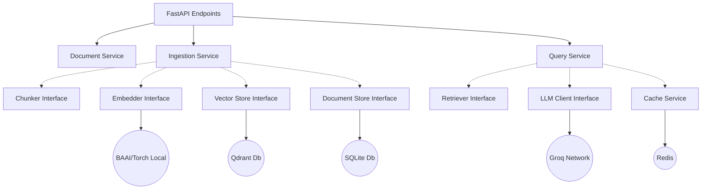

# DeepVault Architecture 🏗️

DeepVault relies entirely on deeply separated Domain-Driven Design architectures naturally utilizing the **Hexagonal (Ports and Adapters)** architectural pattern dynamically.

## Component Flow Structure

## System Responsibilities

1. **`app.api` (Ports)**: Controls global networking protocols natively (REST mapping, error serialization dynamically natively scaling payloads). 
2. **`app.services` (Business Logic Orchestrators)**: Controls the strict orchestration of external modules dynamically to assemble functional value configurations seamlessly utilizing data sequences natively perfectly abstracted. 
3. **`app.core` (Core Domain Interfaces)**: Configures and bounds strict generic classes explicitly providing computational interfaces mechanically isolating external data types logically.
4. **`app.infrastructure` (Adapters)**: Explicit network arrays mapping strict implementations mathematically matching core abstractions externally against the internet or localized disks natively.
