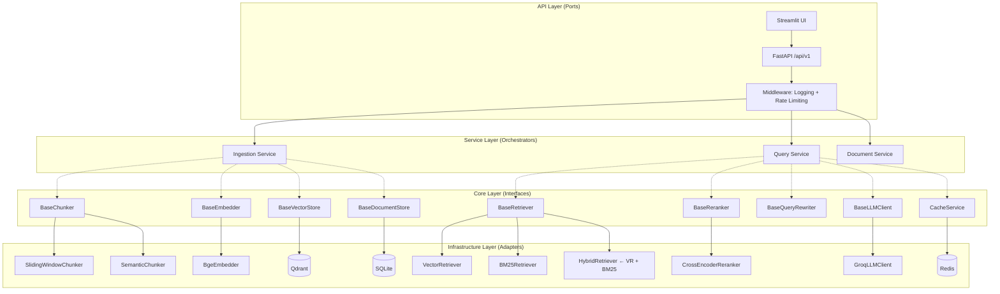

# DeepVault Architecture

DeepVault follows a **Hexagonal (Ports and Adapters)** architecture. Business logic depends only on abstract interfaces, and concrete implementations are injected at runtime. This decoupled approach allows us to swap underlying infrastructure (e.g., migrating from Qdrant to Pinecone or Groq to OpenAI) without changing a single line of business logic.

## Layer Overview

| Layer | Path | Responsibility |
|-------|------|---------------|
| **API** | `app/api/` | HTTP routing, request validation, response serialization, middleware |
| **Services** | `app/services/` | Business logic orchestration (ingestion, query pipeline, document management) |
| **Core** | `app/core/` | Domain models, abstract interfaces (ABCs), custom exceptions |
| **Infrastructure** | `app/infrastructure/` | Concrete implementations (Qdrant, Groq, Redis, SQLite, BGE embedder) |
| **Prompts** | `app/prompts/` | Versioned prompt templates for RAG and evaluation |

## Component Diagram (Phase 4)


```mermaid
graph TD
    subgraph "API Layer (Ports)"
        FE[Streamlit UI] --> API[FastAPI /api/v1]
        API --> MW[Middleware: Logging + Rate Limiting]
    end

    subgraph "Service Layer (Orchestrators)"
        MW --> IS[Ingestion Service]
        MW --> QS[Query Service]
        MW --> DS[Document Service]
    end

    subgraph "Core Layer (Interfaces)"
        IS -.-> CH[BaseChunker]
        IS -.-> EM[BaseEmbedder]
        IS -.-> VS[BaseVectorStore]
        IS -.-> MS[BaseDocumentStore]
        QS -.-> RT[BaseRetriever]
        QS -.-> RNK[BaseReranker]
        QS -.-> RW[BaseQueryRewriter]
        QS -.-> LLM[BaseLLMClient]
        QS -.-> CS[CacheService]
    end

    subgraph "Infrastructure Layer (Adapters)"
        CH --> C1[SlidingWindowChunker]
        CH --> C2[SemanticChunker]
        RT --> VR[VectorRetriever]
        RT --> BM25[BM25Retriever]
        RT --> HY[HybridRetriever ← VR + BM25]
        RNK --> CE[CrossEncoderReranker]
        LLM --> GR[GroqLLMClient]
        EM --> BGE[BgeEmbedder]
        VS --> QD[(Qdrant)]
        MS --> SQL[(SQLite)]
        CS --> RD[(Redis)]
    end
```

## Data Flow

### Ingestion Pipeline
```
File/Text → Hash Check → Chunker → Embedder → Qdrant (vectors) + SQLite (metadata)
```
- The ingestion service first computes a SHA-256 hash of the content to detect duplicates.
- Chunking runs in a thread pool (`asyncio.to_thread`) to avoid blocking the event loop.
- Embeddings are computed in batch via the BGE model.
- Storage uses an inverted write strategy: vectors are written first, then metadata. If metadata storage fails, orphaned vectors are cleaned up from Qdrant.

### Query Pipeline (Phase 4)

For an in-depth walkthrough of the query intelligence features, see [query_pipeline.md](query_pipeline.md).

**Strategy: `auto` (Default)**
```
Question → [Cache Check] → QueryRouter (Classifier)
   ├─ Factual → Hybrid Search (BM25 + Vector)
   ├─ Semantic → Vector Search
   └─ Complex → QueryDecomposer → Parallel Retrieval (Subqueries) → Merge
          ↓
[Reranker] → Context Confidence Guard
          ↓
LLMRouter (Select 8b vs 70b) → Prompt Construction → LLM Generation → [Cache] → Return
```

- All strategies check the Redis cache first (hash-exact match).
- The `QueryRouter` selects the optimal path.
- The **Context Confidence Guard** prevents hallucinations by ensuring the top matching chunk has a sufficient cosine similarity score.
- The response is streamed via SSE for real-time UI updates (`/stream`).

## Dependency Injection

All services receive their dependencies via constructor injection. The `app/dependencies.py` module acts as a service locator, building and caching singleton instances via an `asyncio.Lock` to ensure thread-safety on startup:

```python
async def get_query_service() -> QueryService:
    return QueryService(
        retriever=await get_retriever(),
        llm_client=await get_llm_client(),
        cache_service=await get_cache_service(),
        reranker=await get_reranker(),
        router=await get_query_router(),
        decomposer=await get_query_decomposer(),
        llm_router=await get_llm_router()
    )
```

This makes testing straightforward — each service can be instantiated with mock dependencies, and the singletons ensure we don't accidentally spin up multiple Qdrant connection pools.
