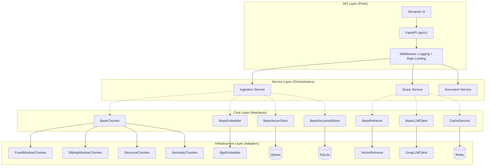

# DeepVault Architecture

DeepVault follows a **Hexagonal (Ports and Adapters)** architecture. Business logic depends only on abstract interfaces, and concrete implementations are injected at runtime.

## Layer Overview

| Layer | Path | Responsibility |
|-------|------|---------------|
| **API** | `app/api/` | HTTP routing, request validation, response serialization, middleware |
| **Services** | `app/services/` | Business logic orchestration (ingestion, query, document management) |
| **Core** | `app/core/` | Domain models, abstract interfaces (ABCs), custom exceptions |
| **Infrastructure** | `app/infrastructure/` | Concrete implementations (Qdrant, Groq, Redis, SQLite, BGE embedder) |
| **Prompts** | `app/prompts/` | Versioned prompt templates for RAG and evaluation |

## Component Diagram


```mermaid
graph TD
    subgraph "API Layer (Ports)"
        FE[Streamlit UI] --> API[FastAPI /api/v1]
        API --> MW[Middleware: Logging + Rate Limiting]
    end

    subgraph "Service Layer (Orchestrators)"
        MW --> IS[Ingestion Service]
        MW --> QS[Query Service]
        MW --> DS[Document Service]
    end

    subgraph "Core Layer (Interfaces)"
        IS -.-> CH[BaseChunker]
        IS -.-> EM[BaseEmbedder]
        IS -.-> VS[BaseVectorStore]
        IS -.-> MS[BaseDocumentStore]
        QS -.-> RT[BaseRetriever]
        QS -.-> LLM[BaseLLMClient]
        QS -.-> CS[CacheService]
    end

    subgraph "Infrastructure Layer (Adapters)"
        CH --> C1[FixedWindowChunker]
        CH --> C2[SlidingWindowChunker]
        CH --> C3[StructureChunker]
        CH --> C4[SemanticChunker]
        RT --> VR[VectorRetriever]
        LLM --> GR[GroqLLMClient]
        EM --> BGE[BgeEmbedder]
        VS --> QD[(Qdrant)]
        MS --> SQL[(SQLite)]
        CS --> RD[(Redis)]
    end
```

## Data Flow

### Ingestion Pipeline
```
File/Text → Hash Check → Chunker → Embedder → Qdrant (vectors) + SQLite (metadata)
```
- The ingestion service first computes a SHA-256 hash of the content to detect duplicates.
- Chunking runs in a thread pool (`asyncio.to_thread`) to avoid blocking the event loop.
- Embeddings are computed in batch via the BGE model.
- Storage uses an inverted write strategy: vectors are written first, then metadata. If metadata storage fails, orphaned vectors are cleaned up from Qdrant.

### Query Pipeline
```
Question → Cache Check → Embed Query → Vector Search → Build Prompt → LLM → Cache Result → Return
```
- Queries first check the Redis cache for an exact hash match.
- On cache miss, the query is embedded and sent to Qdrant for similarity search.
- Retrieved chunks are assembled into a prompt with source citations.
- The LLM response includes token usage telemetry for cost tracking.

## Dependency Injection

All services receive their dependencies via constructor injection. The `app/dependencies.py` module acts as a service locator, building and caching singleton instances:

```python
async def get_query_service() -> QueryService:
    return QueryService(
        retriever=await get_retriever(),
        llm_client=await get_llm_client(),
        cache_service=await get_cache_service(),
    )
```

This makes testing straightforward — each service can be instantiated with mock dependencies.
