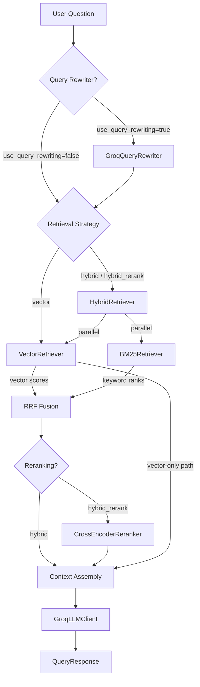

# Phase 2 Retrieval Architecture — Hybrid Search, BM25, and Reranking

**Phase:** 2  
**Status:** Complete  
**Date:** April 2026

---

## Overview

Phase 2 extends DeepVault's retrieval capability from single-strategy vector search to a multi-strategy hybrid pipeline. Three new retrieval components were added, all conforming to the `BaseRetriever` ABC from Phase 1.

```
Phase 1:  Question → [VectorRetriever] → top-5 chunks → LLM
Phase 2:  Question → [HybridRetriever(Vector + BM25)] → RRF → [CrossEncoderReranker] → top-5 chunks → LLM
```

---

## Architecture Diagram



---

## Components

### BM25Retriever (`app/infrastructure/retrievers/bm25.py`)

An in-process BM25Okapi index bootstrapped from the Qdrant chunk payload store.

**Lifecycle:**
1. **Index Bootstrap:** On first `retrieve()` call for a collection, scrolls through all Qdrant payloads and builds an in-memory `BM25Okapi` index over the `content` field.
2. **Retrieval:** Tokenizes the query (lowercase, strip punctuation), runs `get_top_n()` against the index, returns `list[Chunk]` ordered by BM25 score.
3. **Index Freshness:** Index is per-collection, stored in `_indexes: dict[str, BM25Okapi]`. Stale after re-ingestion — must be re-initialized (restart or call `initialize()` again).

**Key Design Choices:**
- Double-checked locking with `asyncio.Lock` prevents concurrent parallel initialization attempts.
- Empty corpus gracefully handled: returns `[]` without error.
- Supports same `filters` interface as `VectorRetriever` (basic `document_id` filtering).

```python
retriever = BM25Retriever(qdrant_client=client)
chunks = await retriever.retrieve(
    query="ISO 27001 compliance requirements",
    top_k=5,
    collection_name="deepvault_fixed"
)
```

---

### HybridRetriever (`app/infrastructure/retrievers/hybrid.py`)

Composes any two `BaseRetriever` instances and fuses their results using Reciprocal Rank Fusion.

**RRF Formula:**
```
score(doc) += weight × (1 / (k + rank))
```
Where `k=60` (Cormack et al., 2009 standard), `weight=0.5` for each retriever by default.

**Parallelism:** Both retrievers are called simultaneously via `asyncio.gather()`.

```python
hybrid = HybridRetriever(
    vector_retriever=VectorRetriever(...),
    bm25_retriever=BM25Retriever(...),
    rrf_k=60,
    vector_weight=0.5,
    bm25_weight=0.5
)
chunks = await hybrid.retrieve(query="...", top_k=5, collection_name="deepvault_fixed")
```

See [ADR-007](../adrs/007-rrf-fusion-strategy.md) for the full decision rationale.

---

### CrossEncoderReranker (`app/infrastructure/rerankers/cross_encoder.py`)

A `BaseReranker` implementation using `cross-encoder/ms-marco-MiniLM-L-6-v2`.

**Pipeline position:** Applied AFTER RRF fusion, BEFORE returning to the LLM.

**Fetch strategy:** `QueryService` fetches `top_k × 4` candidates (e.g., 20 for top_k=5) to give the reranker a diverse pool to re-score.

**Async safety:** Uses `asyncio.to_thread(self.encoder.predict, pairs)` to offload synchronous inference.

**Token limit:** Hard cap at 100 input pairs to prevent OOM on large pools.

```python
reranker = CrossEncoderReranker(model_name="cross-encoder/ms-marco-MiniLM-L-6-v2")
reranked = await reranker.rerank(
    query="what are the data retention requirements?",
    chunks=twenty_rrf_results,
    top_k=5
)
```

See [ADR-008](../adrs/008-cross-encoder-reranker.md) for model selection rationale and benchmark impact.

---

### GroqQueryRewriter (`app/infrastructure/query/rewriter.py`)

An optional `BaseQueryRewriter` that calls the Groq LLM to expand and clarify ambiguous queries before retrieval.

**Prompt template:** `app/prompts/v2/query_rewrite.py`

**When to enable:** Set `use_query_rewriting=true` in the API request body.

**Failure behaviour:** On any exception, falls back to the original query string (fail-open).

```python
rewriter = GroqQueryRewriter(llm_client=groq_client)
expanded_query = await rewriter.rewrite("RAG hallucination problem")
# → "Retrieval-Augmented Generation hallucination issues, factual errors in LLM responses..."
```

> **Note from benchmarks:** Query rewriting showed inconsistent results across chunking strategies. It benefits structure-based chunks (heading vocabulary expansion) but degrades sliding window recall. Not recommended as a default. See [v2.0.0 benchmark](../benchmarks/v2.0.0.md) for details.

---

## Query Pipeline: Strategy Routing

`QueryService.ask()` in `app/services/query.py` handles retrieval strategy dispatch:

```python
valid_strategies = {"vector", "hybrid", "hybrid_rerank"}
strat = (request.retrieval_strategy or "vector").lower()

# Over-fetch for reranking
fetch_k = request.top_k * 4 if strat == "hybrid_rerank" else request.top_k

chunks = await self.retriever.retrieve(
    query=search_query,
    top_k=fetch_k,
    filters=request.filters,
    collection_name=collection_name
)

# Apply reranker if strategy requires it
if strat == "hybrid_rerank" and self.reranker:
    chunks = await self.reranker.rerank(
        query=search_query,
        chunks=chunks,
        top_k=request.top_k
    )
```

---

## Dependency Injection

Phase 2 retrievers are managed as singletons in `app/dependencies.py`:

```python
async def get_retriever(strategy: str | None = None) -> BaseRetriever:
    effective_strategy = strategy or settings.RETRIEVAL_STRATEGY

    if effective_strategy in {"hybrid", "hybrid_rerank"}:
        # Compose vector + BM25 into hybrid
        ...
        return HybridRetriever(vector_retriever=..., bm25_retriever=...)

    elif effective_strategy == "bm25":
        return await get_bm25_retriever()

    else:  # "vector" (default)
        return VectorRetriever(...)
```

Set `RETRIEVAL_STRATEGY` in `.env` or pass `retrieval_strategy` per-request in the API body.

---

## Configuration Reference

| Setting | Default | Options | Description |
|---------|---------|---------|-------------|
| `RETRIEVAL_STRATEGY` | `vector` | `vector`, `hybrid`, `hybrid_rerank` | Default retrieval engine |

**Per-request overrides (API body):**

```json
{
  "query_text": "What are the key principles of zero trust?",
  "retrieval_strategy": "hybrid_rerank",
  "chunking_strategy": "fixed",
  "use_query_rewriting": false,
  "top_k": 5
}
```

---

## Benchmark Results Summary

Full results: [docs/benchmarks/v2.0.0.md](../benchmarks/v2.0.0.md)

| Configuration | Best Chunker | Faithfulness | Hallucination | 
|---------------|-------------|--------------|---------------|
| `vector` | fixed | 3.20 | 37.5% |
| **`hybrid`** | **fixed** 🏆 | **3.30** | **28.6%** |
| `hybrid_rerank` | sliding | 3.00 | 45.7% |

**Recommended:** `fixed` chunking + `hybrid` retrieval. Lowest hallucination rate, highest faithfulness-cost efficiency.
