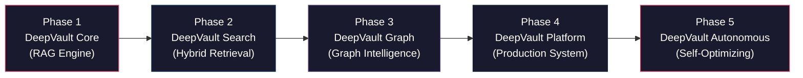
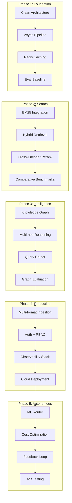

# 🏗️ Enterprise AI Knowledge Intelligence Platform — Master Implementation Plan

> **Project Name**: *DeepVault*  
> **Vision**: A production-grade, self-optimizing AI knowledge platform that evolves from a smart RAG system to an autonomous intelligence engine — built in public, evaluated rigorously, and deployed at every phase.

---

## Table of Contents

1. [Strategic Context & Positioning](#1-strategic-context--positioning)
2. [Changes From Original Draft](#2-changes-from-original-draft)
3. [Architecture Philosophy](#3-architecture-philosophy)
4. [Data Inventory](#4-data-inventory)
5. [Phase 1 — Foundational RAG Engine](#phase-1--foundational-rag-engine-codename-cortex-core)
6. [Phase 2 — Hybrid Retrieval Engine](#phase-2--hybrid-retrieval-engine-codename-cortex-search)
7. [Phase 3 — Graph Intelligence System](#phase-3--graph-intelligence-system-codename-cortex-graph)
8. [Phase 4 — Production AI Platform](#phase-4--production-ai-platform-codename-cortex-platform)
9. [Phase 5 — Autonomous AI System](#phase-5--autonomous-ai-system-codename-cortex-autonomous)
10. [Cross-Cutting Concerns](#10-cross-cutting-concerns)
11. [Repository & Monorepo Strategy](#11-repository--monorepo-strategy)
12. [Total Journey Summary](#12-total-journey-summary)

---

## 1. Strategic Context & Positioning

### Who This Project Is For (The Hiring Manager's Lens)

This project must demonstrate:

| Signal | How We Prove It |
|--------|----------------|
| **System Design** | Clean architecture, dependency injection, interface-driven design |
| **Production Mindset** | Docker, CI/CD, health checks, graceful degradation, structured logging |
| **ML Engineering** | Evaluation pipelines, A/B testing, metric-driven decisions |
| **Software Quality** | 80%+ test coverage, type hints, linting, pre-commit hooks |
| **Communication** | Architecture Decision Records (ADRs), changelogs, benchmark reports |
| **Scalability Thinking** | Async pipelines, queue-based ingestion, caching layers |

### Portfolio Presentation Strategy

Each phase produces:
1. A **standalone GitHub release** with semantic versioning (`v1.0.0`, `v2.0.0`, etc.)
2. A **demo video** (2-3 minutes) showing the system in action
3. A **benchmark report** comparing against the previous phase
4. A **blog post / README section** explaining design decisions
5. A **deployed instance** (even if it's just a free-tier deployment)

---

## 2. Changes From Original Draft

> [!IMPORTANT]
> The following are substantive improvements I've made to your original Level-Wise Plan and Details Draft 1. Each change has a clear rationale.

### 🔴 Critical Additions (Missing from original)

| # | Change | Rationale |
|---|--------|-----------|
| 1 | **Golden Evaluation Dataset from Phase 1** | Your draft introduces evaluation only at L2/L4. Without a baseline evaluation from day one, you can't measure improvement. This is the single most important differentiator for a senior engineer's portfolio. |
| 2 | **Architecture Decision Records (ADRs)** | Senior engineers document *why*, not just *what*. ADRs at every phase show architectural thinking. |
| 3 | **Structured Logging from Phase 1** | Your draft adds observability at L4. But structured logging (JSON logs with correlation IDs) should be foundational — retrofitting it is painful and looks amateur. |
| 4 | **API Contract-First Design (OpenAPI spec)** | The draft jumps to FastAPI without mentioning API design. Contract-first with OpenAPI shows you think about consumers, not just implementation. |
| 5 | **Configuration Management System** | The draft doesn't address environment-based configs, feature flags, or secrets management. Production systems need this from the start. |
| 6 | **Error Taxonomy & Handling Strategy** | The draft mentions "retry + DLQ" but doesn't define error categories, retry policies, or circuit breakers. |
| 7 | **Data Validation Layer** | No mention of Pydantic models for request/response validation, document schema validation, or chunk quality checks. |
| 8 | **Reproducibility Infrastructure** | Pinned dependencies, seed management for embeddings, deterministic chunking — critical for evaluation comparisons. |

### 🟡 Structural Improvements

| # | Change | Rationale |
|---|--------|-----------|
| 9 | **Sub-phases within each Level** | Your levels are too monolithic. Breaking L1 into 1A (core pipeline) → 1B (caching + async) → 1C (evaluation baseline) gives clearer checkpoints and prevents scope creep. |
| 10 | **Moved Testing to Phase 1** | Draft puts testing in L4. This is a red flag for any senior reviewer. Tests start from day one, period. |
| 11 | **Moved Docker to Phase 1** | Draft puts Docker in L4. If Phase 1 isn't containerized, it can't be a "standalone project." Docker-compose from the beginning. |
| 12 | **Moved CI/CD to Phase 1** | Same reasoning. GitHub Actions with lint + test + build from day one. |
| 13 | **Separation of Ingestion and Query paths** | The draft mixes ingestion pipeline into L4. The ingestion pipeline should be a distinct, well-architected subsystem from L1, evolving in sophistication at each phase. |
| 14 | **Explicit Interface/Abstract Base Class Design** | Each retriever, chunker, and LLM client should implement an interface. This enables the plug-and-play architecture needed for L2-L5. |

### 🟢 Scope Refinements

| # | Change | Rationale |
|---|--------|-----------|
| 15 | **Removed Next.js frontend from critical path** | A beautiful frontend is nice but not the value proposition. Use Streamlit for Phase 1-3, introduce a proper frontend only at Phase 4. Your engineering depth is in the backend. |
| 16 | **Replaced vague "metrics dashboard" with Grafana** | "Custom dashboard" is scope creep. Grafana + Prometheus is industry standard and shows you know the ecosystem. |
| 17 | **Scoped down Agent Layer** | The draft's agent layer (SQL tool, summarization, extraction) is too broad. Focus on 1-2 tools that directly enhance the RAG pipeline, not generic tool use. |
| 18 | **Added explicit cost tracking** | The draft mentions "cost tracking" but doesn't specify how. We'll track cost-per-query with token counting and model pricing tables. |
| 19 | **Added Prompt Versioning** | No mention of prompt management in the draft. Prompts should be versioned, tracked, and part of the evaluation pipeline. |

---

## 3. Architecture Philosophy

### Design Principles

```
┌─────────────────────────────────────────────────────────┐
│                   DESIGN PRINCIPLES                      │
├─────────────────────────────────────────────────────────┤
│ 1. Interface-Driven Design (Program to abstractions)    │
│ 2. Dependency Injection (No hard-coded dependencies)    │
│ 3. Configuration Over Code (Feature flags, env vars)    │
│ 4. Fail Gracefully (Circuit breakers, fallbacks)        │
│ 5. Observe Everything (Structured logs, metrics)        │
│ 6. Test at Every Layer (Unit, Integration, Eval)        │
│ 7. Evolve, Don't Rewrite (Each phase extends prior)    │
│ 8. Document Decisions (ADRs for every major choice)     │
└─────────────────────────────────────────────────────────┘
```

### Evolution Strategy



Each phase:
- **Extends** the previous phase's codebase (no rewrites)
- **Replaces concrete implementations** behind stable interfaces
- **Adds new capabilities** through new modules, not modifications to old ones
- **Produces a tagged release** that can be deployed independently

---

## 4. Data Inventory

### What You Already Have

| Category | Count | Format | Quality |
|----------|-------|--------|---------|
| Synthetic Project Docs | 10 | Markdown | Good — structured with teams, tech stacks, decisions |
| Synthetic Meeting Notes | 8 | Markdown | Good — realistic with action items, debates |
| Synthetic Incident Reports | 6 | Markdown | Good — proper post-mortem format with timelines |
| Synthetic Wiki Pages | 8 | Markdown | Good — technical guides with architecture details |
| Research Papers (RAG/IR) | ~72 | PDF | Mixed — some unrelated (physics, math). ~40 are relevant |
| **Total Synthetic Docs** | **32** | | |

### Data Improvements Needed (Phase 0 Pre-work - DATA SPRINT)

> [!WARNING]
> We are scaling to a ~120 document synthetic dataset to prove enterprise retrieval quality. We will generate highly interconnected documents using Groq.

**Target Document Mix (Total: ~120)**
1. **Slack-style conversations** (25 docs): Simulate debugging, planning, and urgent requests.
2. **API documentation** (15 docs): Endpoints, schemas, error codes.
3. **Runbook/SOP documents** (15 docs): Operational playbooks, deployment steps.
4. **Project Docs** (15 docs): Architecture, requirements, planning.
5. **Meeting Notes** (20 docs): Action items, decisions, debates.
6. **Incident Reports** (15 docs): Post-mortems, timelines.
7. **Wiki Pages** (15 docs): Technical guides, concepts.

**Key Requirements for Generation:**
- **Cross-referencing:** >50% of docs must reference other projects, engineers, or previous incidents.
- **Temporal spread:** Events spanned over a 12-18 month timeline.
- **Varying lengths:** Mix of 200-word quick notes and 2500-word deep dives.
- **Golden Evaluational Dataset:** 80-100 ground-truth Q&A pairs generated from this corpus.
- **Research Papers:** Filter the PDF papers to the 40-50 most relevant RAG/Search/LLM papers to be ingested.

---

## Phase 1 — Foundational RAG Engine (Codename: *DeepVault Core*)

### 🎯 Positioning Statement
*"Production-ready RAG system with async architecture, structured caching, comprehensive testing, and a baseline evaluation framework — not a LangChain wrapper."*

### What This Phase Proves
- You can build a clean, well-architected backend from scratch
- You understand async Python, caching strategies, and API design
- You test your code and measure your system's quality with real metrics
- You can containerize and deploy a working system

---

### Sub-Phase 1A: Core Pipeline (Days 1-2)

#### Deliverables
- FastAPI application with OpenAPI specification
- Document ingestion pipeline (Markdown → chunks → embeddings → vector store)
- Basic query pipeline (question → embedding → retrieval → LLM → response)
- Pydantic models for all request/response schemas
- Structured JSON logging with correlation IDs
- Unit tests for all core components

#### Architecture

```
┌──────────────────────────────────────────────────────────────┐
│                     FastAPI Application                       │
│                                                              │
│  ┌─────────────┐    ┌──────────────┐    ┌────────────────┐  │
│  │  /api/ingest │    │  /api/query  │    │  /api/health   │  │
│  └──────┬──────┘    └──────┬───────┘    └────────────────┘  │
│         │                  │                                 │
│  ┌──────▼──────────────────▼──────────────────────────────┐ │
│  │              Service Layer (Business Logic)             │ │
│  │  ┌────────────┐  ┌──────────────┐  ┌────────────────┐  │ │
│  │  │ Ingestion  │  │   Query      │  │  Document      │  │ │
│  │  │ Service    │  │   Service    │  │  Service       │  │ │
│  │  └─────┬──────┘  └──────┬───────┘  └────────────────┘  │ │
│  └────────┼────────────────┼──────────────────────────────┘ │
│           │                │                                 │
│  ┌────────▼────────────────▼──────────────────────────────┐ │
│  │              Core Layer (Abstractions)                   │ │
│  │                                                         │ │
│  │  ┌──────────────┐   ┌────────────┐  ┌──────────────┐   │ │
│  │  │ BaseChunker  │   │BaseRetriever│  │ BaseLLMClient│   │ │
│  │  │ (ABC)        │   │  (ABC)     │  │   (ABC)      │   │ │
│  │  └──────┬───────┘   └─────┬──────┘  └──────┬───────┘   │ │
│  │         │                 │                 │           │ │
│  │  ┌──────▼───────┐  ┌─────▼──────┐  ┌──────▼───────┐   │ │
│  │  │FixedChunker  │  │VectorRetrvr│  │GroqClient    │   │ │
│  │  │SlidingChunker│  │            │  │OpenAIClient  │   │ │
│  │  └──────────────┘  └────────────┘  └──────────────┘   │ │
│  └─────────────────────────────────────────────────────────┘ │
│                                                              │
│  ┌─────────────────────────────────────────────────────────┐ │
│  │              Infrastructure Layer                        │ │
│  │  ┌────────┐  ┌────────┐  ┌──────────┐  ┌────────────┐  │ │
│  │  │ Qdrant │  │ SQLite │  │ Logging  │  │   Config   │  │ │
│  │  │        │  │        │  │ (JSON)   │  │ (Pydantic) │  │ │
│  │  └────────┘  └────────┘  └──────────┘  └────────────┘  │ │
│  └─────────────────────────────────────────────────────────┘ │
└──────────────────────────────────────────────────────────────┘
```

#### Key Design Decisions (ADRs to write)

| ADR | Decision | Alternatives Considered |
|-----|----------|------------------------|
| ADR-001 | Use Qdrant (not FAISS) as vector DB | FAISS (no metadata filtering), Pinecone (vendor lock-in), ChromaDB (less production-ready) |
| ADR-002 | Use Pydantic Settings for configuration | python-dotenv only (no validation), dynaconf (overkill for Phase 1) |
| ADR-003 | Interface-driven design with ABCs | Concrete classes (harder to extend), Protocol types (less explicit) |
| ADR-004 | SQLite for document metadata (Phase 1) | PostgreSQL (overhead for Phase 1), in-memory (no persistence) |
| ADR-005 | Groq LLMs (Llama 3/Mixtral) as primary | OpenAI (no access), local models (hardware dependent) |

#### Directory Structure (Phase 1)

```
cortex/
├── app/
│   ├── __init__.py
│   ├── main.py                    # FastAPI app factory
│   ├── config.py                  # Pydantic Settings
│   ├── dependencies.py            # Dependency injection
│   │
│   ├── api/
│   │   ├── __init__.py
│   │   ├── routes/
│   │   │   ├── ingest.py          # POST /api/v1/documents
│   │   │   ├── query.py           # POST /api/v1/query
│   │   │   └── health.py          # GET /api/v1/health
│   │   ├── schemas/
│   │   │   ├── requests.py        # Pydantic request models
│   │   │   └── responses.py       # Pydantic response models
│   │   └── middleware/
│   │       └── logging.py         # Request/response logging
│   │
│   ├── core/
│   │   ├── __init__.py
│   │   ├── interfaces/
│   │   │   ├── chunker.py         # BaseChunker ABC
│   │   │   ├── retriever.py       # BaseRetriever ABC
│   │   │   ├── llm_client.py      # BaseLLMClient ABC
│   │   │   ├── embedder.py        # BaseEmbedder ABC
│   │   │   └── document_store.py  # BaseDocumentStore ABC
│   │   ├── models/
│   │   │   ├── document.py        # Document, Chunk domain models
│   │   │   └── query.py           # Query, QueryResult models
│   │   └── exceptions.py          # Custom exception hierarchy
│   │
│   ├── services/
│   │   ├── __init__.py
│   │   ├── ingestion.py           # Ingestion orchestration
│   │   ├── query.py               # Query orchestration
│   │   └── document.py            # Document management
│   │
│   ├── infrastructure/
│   │   ├── __init__.py
│   │   ├── chunkers/
│   │   │   ├── fixed.py           # FixedWindowChunker
│   │   │   └── sliding.py         # SlidingWindowChunker
│   │   ├── retrievers/
│   │   │   └── vector.py          # QdrantRetriever
│   │   ├── llm/
│   │   │   ├── groq.py            # GroqLLMClient
│   │   │   └── openai.py          # OpenAILLMClient
│   │   ├── embedders/
│   │   │   └── sentence_transformer.py
│   │   ├── stores/
│   │   │   └── sqlite.py          # SQLiteDocumentStore
│   │   └── logging/
│   │       └── structured.py      # JSON structured logger
│   │
│   └── prompts/
│       ├── __init__.py
│       └── v1/
│           ├── system.py          # System prompts
│           └── query.py           # Query prompts
│
├── tests/
│   ├── __init__.py
│   ├── conftest.py                # Shared fixtures
│   ├── unit/
│   │   ├── test_chunkers.py
│   │   ├── test_retrievers.py
│   │   ├── test_ingestion.py
│   │   └── test_query_service.py
│   └── integration/
│       ├── test_ingest_pipeline.py
│       └── test_query_pipeline.py
│
├── docs/
│   ├── adrs/                      # Architecture Decision Records
│   │   ├── 001-vector-db-choice.md
│   │   └── ...
│   └── architecture.md
│
├── scripts/
│   ├── seed_data.py               # Load synthetic data
│   └── run_eval.py                # Run evaluation suite
│
├── docker/
│   ├── Dockerfile
│   └── docker-compose.yml         # App + Qdrant
│
├── .github/
│   └── workflows/
│       └── ci.yml                 # Lint + Test + Build
│
├── pyproject.toml                 # Project config (uv/poetry)
├── Makefile                       # Common commands
├── .pre-commit-config.yaml
└── README.md
```

#### Acceptance Criteria (Sub-Phase 1A)
- [ ] `POST /api/v1/documents` accepts markdown files and stores chunks + embeddings
- [ ] `POST /api/v1/query` returns an answer with source citations
- [ ] `GET /api/v1/health` returns system status
- [ ] All request/response models are Pydantic validated
- [ ] Structured JSON logs with request IDs on every request
- [ ] Unit tests pass with >80% coverage on core + services
- [ ] Integration test: ingest 5 docs → query → verify relevant response
- [ ] `docker-compose up` starts the full system
- [ ] CI pipeline: lint (ruff) → type-check (mypy) → test (pytest) → build (docker)
- [ ] OpenAPI spec visible at `/docs`

---

### Sub-Phase 1B: Caching & Async (Day 3)

#### What You Add
- **Redis caching layer** with two cache strategies:
  - **Semantic cache**: Hash query embeddings, return cached responses for similar queries
  - **Embedding cache**: Cache document embeddings to avoid recomputation
- **Async ingestion pipeline**: Background task processing with FastAPI BackgroundTasks (not Celery yet)
- **Basic metadata filtering**: Filter chunks by document type, project name

#### Key Implementation Details

```
Query Flow with Cache:
                                                          
  Query → Hash → Cache Check ─── HIT ──→ Return Cached Response
                     │                         
                     └── MISS ──→ Retrieve → LLM → Cache Response → Return
```

#### Acceptance Criteria (Sub-Phase 1B)
- [ ] Redis caching reduces repeated query latency by >80%
- [ ] Async ingestion returns `202 Accepted` and processes in background
- [ ] Cache hit/miss ratio is logged and visible in structured logs
- [ ] TTL-based cache invalidation is configurable
- [ ] `docker-compose.yml` updated with Redis
- [ ] Latency benchmark: before vs. after caching (include in README)

---

### Sub-Phase 1C: Evaluation Baseline (Days 4-5)

> [!IMPORTANT]
> This sub-phase is the **most important** of Phase 1. Without this, everything that follows has no measurable baseline. This is what separates a junior project from a senior one.

#### What You Build

1. **Golden Q&A Dataset** (80-100 questions)
   - Manually curated from your synthetic data
   - Categories: factual, semantic, cross-document
   - Stored as a versioned JSON/YAML file
   
2. **Evaluation Pipeline**
   - Automated script that runs all golden questions through the pipeline
   - Measures: retrieval precision@k, recall@k, answer relevance, faithfulness
   - Uses LLM-as-judge (with a separate model) for answer quality scoring
   - Produces a JSON report + summary markdown

3. **Baseline Benchmark Report**
   - Fixed-window chunking results
   - Sliding-window chunking results  
   - Comparison table
   - Latency percentiles (p50, p95, p99)

#### Evaluation Schema

```json
{
  "eval_id": "eval-001",
  "timestamp": "2026-04-15T10:00:00Z",
  "system_version": "v1.0.0",
  "config": {
    "chunker": "sliding_window",
    "chunk_size": 512,
    "overlap": 0.2,
    "embedding_model": "all-MiniLM-L6-v2",
    "llm": "llama3-8b-8192",
    "top_k": 5
  },
  "metrics": {
    "retrieval_precision_at_5": 0.72,
    "retrieval_recall_at_5": 0.65,
    "answer_relevance": 0.78,
    "faithfulness": 0.85,
    "avg_latency_ms": 1200,
    "p95_latency_ms": 2800,
    "total_questions": 50,
    "questions_with_correct_retrieval": 36
  },
  "detailed_results": [ ... ]
}
```

#### Acceptance Criteria (Sub-Phase 1C)
- [ ] Golden dataset with 80+ questions, ground-truth answers, and ground-truth source documents
- [ ] `make eval` command runs full evaluation and produces a report
- [ ] Baseline benchmark report committed to `docs/benchmarks/v1.0.0.md`
- [ ] Two chunking strategies compared with statistical results
- [ ] Evaluation is deterministic (same seed → same results)

---

### Phase 1 Final Deliverables

| Deliverable | Location |
|-------------|----------|
| Working deployed system | Docker / free-tier cloud |
| GitHub Release `v1.0.0` | Tagged release with changelog |
| Architecture diagram | `docs/architecture.md` |
| ADRs (5+) | `docs/adrs/` |
| Benchmark report | `docs/benchmarks/v1.0.0.md` |
| README with setup + demo | `README.md` |
| CI/CD (green) | `.github/workflows/` |
| Demo video (2-3 min) | Linked in README |

### ⏱️ Estimated Time: 30-45 hours

---

## Phase 2 — Hybrid Retrieval Engine (Codename: *DeepVault Search*)

### 🎯 Positioning Statement
*"Hybrid search system combining semantic, keyword, and re-ranking — with rigorous retrieval benchmarks proving each component's contribution."*

### What This Phase Proves
- You understand information retrieval theory, not just embedding similarity
- You can implement and evaluate multiple retrieval strategies
- You make data-driven decisions about system design

---

### Sub-Phase 2A: BM25 Integration (Days 6-7)

#### What You Add
- **BM25 retriever** implementing `BaseRetriever` interface
  - Use Elasticsearch (via Docker) OR a lightweight option like `rank-bm25` Python library
  - Decision: Start with `rank-bm25` library for simplicity, migrate to Elasticsearch in Phase 4
- **Hybrid retriever** that combines BM25 + vector results
  - Reciprocal Rank Fusion (RRF) as the default merging strategy
  - Configurable weights for each retrieval method
- **Query preprocessing**
  - Query expansion (synonym-based)
  - Stop-word handling for BM25

#### New Interface Implementation

```
BaseRetriever (existing ABC)
├── VectorRetriever (Phase 1)  
├── BM25Retriever (NEW)
└── HybridRetriever (NEW) ← composes Vector + BM25
```

#### Acceptance Criteria (Sub-Phase 2A)
- [ ] BM25Retriever passes same unit test suite as VectorRetriever
- [ ] HybridRetriever combines results using RRF
- [ ] Configurable weights via environment variables
- [ ] Integration test: queries that should favor keyword match return correct docs
- [ ] Integration test: queries that should favor semantic match return correct docs

---

### Sub-Phase 2B: Re-Ranking Pipeline (Day 8)

#### What You Add
- **Cross-encoder re-ranker** (using `sentence-transformers` cross-encoder models)
  - `BaseReranker` ABC introduced
  - `CrossEncoderReranker` implementation
- **Query rewriting** module
  - LLM-based query rewriting for ambiguous queries
  - Step-back prompting for complex questions
- Re-ranked results pipeline:

```
Query → Hybrid Retrieval (top-20) → Cross-Encoder Re-rank → Top-5 → LLM
```

#### Acceptance Criteria (Sub-Phase 2B)
- [ ] Re-ranker measurably improves retrieval precision (benchmark required)
- [ ] Query rewriting handles at least 3 query patterns (ambiguous, multi-part, abbreviation-heavy)
- [ ] Pipeline is configurable: can enable/disable re-ranker and query rewriting independently
- [ ] Latency impact of re-ranking is documented

---

### Sub-Phase 2C: Comparative Evaluation (Day 9)

> [!IMPORTANT]
> This is where your project starts to **scream senior engineer**. You're not just building features — you're proving their value with data.

#### Evaluation Matrix

Run the golden dataset through every combination:

| Configuration | Retrieval P@5 | Recall@5 | Latency (p50) | Latency (p95) |
|--------------|--------------|----------|---------------|----------------|
| Vector only (Phase 1 baseline) | ? | ? | ? | ? |
| BM25 only | ? | ? | ? | ? |
| Hybrid (RRF, equal weight) | ? | ? | ? | ? |
| Hybrid (RRF, vector-heavy) | ? | ? | ? | ? |
| Hybrid + Re-rank | ? | ? | ? | ? |
| Hybrid + Re-rank + Query Rewrite | ? | ? | ? | ? |

#### Deliverables
- Benchmark report with charts comparing all configurations
- Statistical significance tests (not just "it's better")
- Latency vs. quality tradeoff analysis
- Recommendation for default configuration with justification

#### Acceptance Criteria (Sub-Phase 2C)
- [ ] Full comparison table with 6+ configurations
- [ ] Visualization (charts) in benchmark report
- [ ] `make eval` updated to support configuration matrix
- [ ] Benchmark report committed to `docs/benchmarks/v2.0.0.md`
- [ ] README updated with Phase 2 architecture diagram

---

### Phase 2 Final Deliverables

| Deliverable | Location |
|-------------|----------|
| GitHub Release `v2.0.0` | Tagged release with changelog |
| Benchmark: Phase 1 vs Phase 2 | `docs/benchmarks/v2.0.0.md` |
| ADRs (3+) for retrieval decisions | `docs/adrs/` |
| Updated architecture diagram | `docs/architecture.md` |
| Demo video showing hybrid retrieval | Linked in README |

### ⏱️ Estimated Time: 35-50 hours

---

## Phase 3 — Graph Intelligence System (Codename: *DeepVault Graph*)

### 🎯 Positioning Statement
*"Graph-powered AI system capable of multi-hop reasoning across interconnected enterprise knowledge, with a query router that dynamically selects the optimal retrieval strategy."*

### What This Phase Proves
- You understand knowledge graphs and relationship modeling
- You can implement multi-hop reasoning (not just single-hop retrieval)
- You can design intelligent routing systems
- This is where 95% of RAG portfolio projects stop. Going here shows you're serious.

---

### Sub-Phase 3A: Knowledge Graph Construction (Days 10-11)

#### What You Add
- **Entity extraction pipeline** during ingestion
  - NER using spaCy + LLM-based extraction for domain-specific entities
  - Entity types: `Person`, `Project`, `Tool/Technology`, `Team`, `Incident`, `Decision`
  - Relationship types: `WORKS_ON`, `USES`, `CAUSED`, `DECIDED`, `ATTENDED`, `REPORTED_BY`
- **Neo4j graph database** integration
  - `BaseGraphStore` ABC
  - `Neo4jGraphStore` implementation
  - Graph schema design and indexing
- **Graph ingestion** integrated into existing pipeline

#### Entity/Relationship Schema

```
(:Person {name, role, team})
(:Project {name, status, start_date})
(:Technology {name, category})
(:Incident {id, severity, date})
(:Meeting {date, project})
(:Document {id, type, title})

(:Person)-[:WORKS_ON]->(:Project)
(:Person)-[:USES]->(:Technology)
(:Person)-[:ATTENDED]->(:Meeting)
(:Person)-[:REPORTED]->(:Incident)
(:Incident)-[:AFFECTS]->(:Project)
(:Project)-[:USES]->(:Technology)
(:Document)-[:MENTIONS]->(:Person|Project|Technology)
(:Decision)-[:MADE_IN]->(:Meeting)
```

#### Acceptance Criteria (Sub-Phase 3A)
- [ ] Entity extraction extracts person, project, technology entities with >80% accuracy on golden set
- [ ] Neo4j populated with entities and relationships from all synthetic documents
- [ ] Graph visualization shows interconnected knowledge
- [ ] `docker-compose.yml` includes Neo4j
- [ ] Unit tests for entity extraction and graph storage

---

### Sub-Phase 3B: Graph Retrieval & Multi-hop Reasoning (Days 12-13)

#### What You Add
- **Graph retriever** implementing `BaseRetriever`
  - Cypher query generation from natural language
  - Multi-hop traversal (2-3 hops)
  - Returns graph context alongside text chunks
- **Query decomposition** for complex queries
  - Breaks "Who worked with Sarah on the project that had the Kafka incident?" into:
    1. Find incident involving Kafka
    2. Find project associated with that incident
    3. Find people who worked on that project with Sarah

#### Multi-hop Query Examples (from your data)

```
Q: "Who attended meetings for the project that had the Kafka consumer lag incident?"
→ Step 1: Find incident about Kafka → Project Nexus
→ Step 2: Find meetings about Project Nexus  
→ Step 3: Find attendees of those meetings
→ Answer: Tyler, Wei, Sarah (from incident + related meetings)

Q: "What technologies are shared between Project Aurora and Project Chimera?"  
→ Step 1: Find technologies used by Project Aurora → Ray, PyTorch, HuggingFace
→ Step 2: Find technologies used by Project Chimera → LangChain, PostgreSQL, Docker, K8s
→ Step 3: Find intersection → Docker/K8s (if both use them)

Q: "What decisions were made about caching in Project Titan meetings?"
→ Step 1: Find meetings about Project Titan
→ Step 2: Extract decisions about caching
→ Answer: Agreed to pursue Redis caching, Sophia leading implementation
```

#### Acceptance Criteria (Sub-Phase 3B)
- [ ] Graph retriever handles relational queries that vector search cannot
- [ ] Multi-hop reasoning works for 2-3 hop queries
- [ ] Query decomposition breaks complex queries into steps (visible in logs)
- [ ] Graph context is included in LLM prompt alongside text chunks

---

### Sub-Phase 3C: Retrieval Router v1 (Day 14)

#### What You Add
- **Query classification model** (rule-based first, ML later)
  - Classifies queries into: `factual`, `semantic`, `relational`
  - Routes to appropriate retriever(s)
- **Retrieval router** that orchestrates retrieval strategy

```
┌──────────────────────────────┐
│       Query Router           │
│                              │
│  Query → Classify → Route    │
│                              │
│  factual  → BM25-heavy       │
│  semantic → vector-heavy     │
│  relational → graph          │
│  complex → decompose + multi │
└──────────────────────────────┘
```

#### Acceptance Criteria (Sub-Phase 3C)
- [ ] Query classifier correctly routes 80%+ of golden dataset queries
- [ ] Router uses graph retriever for relational queries
- [ ] Router falls back gracefully if a retrieval method fails
- [ ] Full benchmark comparison: routed vs. always-hybrid vs. always-vector

---

### Sub-Phase 3D: Graph Evaluation & Benchmarks (Days 15-16)

#### Expanded Golden Dataset
- Add 20+ relational/multi-hop questions to golden dataset
- Categories now include: `factual`, `semantic`, `cross-document`, `relational`, `multi-hop`

#### Evaluation Matrix (Phase 3)

| Configuration | Factual P@5 | Semantic P@5 | Relational P@5 | Multi-hop P@5 | Avg Latency |
|--------------|------------|-------------|----------------|--------------|-------------|
| Vector only (P1) | ? | ? | N/A | N/A | ? |
| Hybrid + Rerank (P2) | ? | ? | N/A | N/A | ? |
| Graph only | ? | ? | ? | ? | ? |
| Hybrid + Graph (unrouted) | ? | ? | ? | ? | ? |
| **Routed (full system)** | ? | ? | ? | ? | ? |

#### Phase 3 Final Deliverables

| Deliverable | Location |
|-------------|----------|
| GitHub Release `v3.0.0` | Tagged release |
| Graph schema documentation | `docs/graph-schema.md` |
| Multi-hop query demos | Demo video |
| Benchmark: P1 vs P2 vs P3 | `docs/benchmarks/v3.0.0.md` |
| Router accuracy report | Included in benchmark |

### ⏱️ Estimated Time: 45-65 hours

---

## Phase 4 — Production AI Platform (Codename: *DeepVault Platform*)

### 🎯 Positioning Statement
*"Production-grade AI platform with enterprise ingestion pipeline, authentication, observability, streaming responses, and cloud deployment — built to serve real users."*

### What This Phase Proves
- You can build production systems, not just prototypes
- You understand security, access control, and multi-tenancy
- You know observability tooling (Prometheus, Grafana)
- You can deploy and operate systems in the cloud

---

### Sub-Phase 4A: Enterprise Ingestion Pipeline (Days 17-18)

#### What You Add
- **Multi-format document parsing**
  - PDF (PyMuPDF), DOCX (python-docx), HTML (BeautifulSoup)
  - Add your research papers as a real test case!
- **Semantic chunking** (`BaseChunker` → `SemanticChunker`)
  - Embedding-based boundary detection
  - Compare against fixed/sliding window
- **Document versioning**
  - Version tracking in metadata store
  - Soft-delete old versions, query always hits latest
- **Celery + Redis workers** for async ingestion
  - Retry logic (3 attempts, exponential backoff)
  - Dead Letter Queue (DLQ) for failed documents
  - Progress tracking via API

#### Acceptance Criteria (Sub-Phase 4A)
- [ ] Successfully ingests PDF research papers alongside markdown docs
- [ ] Semantic chunking produces measurably better retrieval results
- [ ] Document versioning works (re-ingest → new version, old queries still work)
- [ ] Celery workers process ingestion queue with retry/DLQ
- [ ] Progress endpoint: `GET /api/v1/documents/{id}/status`

---

### Sub-Phase 4B: Authentication & Access Control (Day 19)

#### What You Add
- **JWT authentication** (FastAPI security)
- **Role-based access control (RBAC)**
  - Roles: `admin`, `user`, `viewer`
  - Admin: upload docs, manage users, run evaluations
  - User: query, provide feedback
  - Viewer: query only
- **Document-level permissions**
  - Each document has `allowed_roles` / `allowed_users`
  - Retrieval filters based on user permissions (vector DB metadata filtering)
- **Migrate from SQLite to PostgreSQL**

#### Acceptance Criteria (Sub-Phase 4B)
- [ ] JWT auth on all protected endpoints
- [ ] Users only see documents they have access to (verified with tests)
- [ ] Admin endpoints for user and document management
- [ ] PostgreSQL as the primary metadata store
- [ ] Auth integration tests with multiple user roles

---

### Sub-Phase 4C: Observability Stack (Day 20)

#### What You Add
- **Prometheus metrics** exposed at `/metrics`
  - `request_latency_seconds` (histogram, by endpoint)
  - `retrieval_latency_seconds` (histogram, by strategy)
  - `llm_latency_seconds` (histogram, by model)
  - `tokens_used_total` (counter, by model)
  - `cache_hit_total` / `cache_miss_total` (counters)
  - `ingestion_documents_total` (counter, by status)
  - `errors_total` (counter, by type)
- **Grafana dashboards**
  - System Overview (latency, throughput, error rate)
  - LLM Cost Dashboard (tokens, cost per query)
  - Retrieval Performance (strategy distribution, quality)
  - Ingestion Pipeline (queue depth, processing rate, failures)
- **Structured log aggregation** (existing logs → ready for ELK/Loki)
- **Health check enhancement** with dependency health (`/api/v1/health/detailed`)

#### Acceptance Criteria (Sub-Phase 4C)
- [ ] Prometheus metrics endpoint functional
- [ ] 4 Grafana dashboards provisioned via docker-compose
- [ ] Health check reports status of all dependencies (Qdrant, Redis, Neo4j, PostgreSQL)
- [ ] Latency percentiles visible and accurate
- [ ] Token usage and estimated cost tracked per query

---

### Sub-Phase 4D: Streaming & Enhanced UX (Days 21-22)

#### What You Add
- **Server-Sent Events (SSE)** for streaming LLM responses
- **Source highlighting** (return source chunks with relevance scores)
- **Streamlit UI** implementation
  - Chat interface with streaming
  - Source panel showing retrieved documents
  - Basic admin panel integration
- **Rate limiting** (per-user, per-minute)

#### Acceptance Criteria (Sub-Phase 4D)
- [ ] Streaming responses work end-to-end
- [ ] UI shows sources alongside answers
- [ ] Rate limiting prevents abuse (configurable limits)
- [ ] Frontend is responsive and functional

---

### Sub-Phase 4E: Cloud Deployment & CI/CD (Days 23-24)

#### What You Add
- **Production Docker setup**
  - Multi-stage Dockerfile (build → runtime)
  - Docker Compose for full stack (app, Qdrant, Redis, Neo4j, PostgreSQL, Prometheus, Grafana)
- **CI/CD pipeline** (GitHub Actions)
  - On PR: lint → type-check → unit tests → integration tests
  - On merge to main: build → push image → deploy
- **Cloud deployment**
  - Target: AWS Free Tier (EC2 with docker-compose)
  - Environment-based configuration
  - Secrets management

#### Acceptance Criteria (Sub-Phase 4E)
- [ ] System is deployed and accessible via public URL
- [ ] CI/CD pipeline runs automatically on every push
- [ ] Environment-based configuration works (dev, staging, prod)
- [ ] Zero-downtime deployment strategy documented

---

### Phase 4 Final Deliverables

| Deliverable | Location |
|-------------|----------|
| GitHub Release `v4.0.0` | Tagged release |
| **Live deployed system** | Public URL |
| Grafana dashboard screenshots | `docs/observability.md` |
| Benchmark: all phases compared | `docs/benchmarks/v4.0.0.md` |
| Security architecture doc | `docs/security.md` |
| Admin dashboard demo | Demo video |

### ⏱️ Estimated Time: 55-80 hours

---

## Phase 5 — Autonomous AI System (Codename: *DeepVault Autonomous*)

### 🎯 Positioning Statement
*"Self-optimizing AI system with dynamic routing, cost optimization, feedback loops, automated evaluation, and A/B testing — a system that gets better over time without manual intervention."*

### What This Phase Proves
- You can build ML systems that learn from production data
- You understand cost optimization and model routing
- You can design and run A/B experiments
- You think about systems that improve themselves

---

### Sub-Phase 5A: Advanced Retrieval Router (Days 25-26)

#### What You Add
- **ML-based query classifier** (replace rule-based from Phase 3)
  - Fine-tune a small classification model on query types
  - Dynamic weight adjustment based on historical performance
  - Confidence-based routing (low confidence → use all strategies)
- **Router performance tracking**
  - Log which strategy was selected and its outcome
  - Track router accuracy over time

#### Acceptance Criteria (Sub-Phase 5A)
- [ ] ML classifier outperforms rule-based router (benchmark required)
- [ ] Router dynamically adjusts weights based on feedback
- [ ] Confidence-based fallback prevents bad routing decisions
- [ ] Router accuracy tracked in Grafana

---

### Sub-Phase 5B: LLM Router & Cost Optimization (Day 27)

#### What You Add
- **LLM router** that selects model based on query complexity
  - Simple queries → cheap/fast model (e.g., Llama-3-8b via Groq)
  - Complex queries → powerful model (e.g., Llama-3-70b/Mixtral via Groq)
  - Complexity classifier (prompt length, query type, required reasoning depth)
- **Cost tracking dashboard**
  - Cost per query by model
  - Daily/weekly cost trends
  - Cost savings from routing vs. always using expensive model
- **Fallback chain**: primary → retry → fallback model → partial answer

#### Acceptance Criteria (Sub-Phase 5B)
- [ ] LLM router reduces cost by >30% without quality degradation (benchmark)
- [ ] Fallback chain handles model failures gracefully
- [ ] Cost dashboard shows real savings data
- [ ] Quality comparison: cheap-model-only vs. expensive-only vs. routed

---

### Sub-Phase 5C: Feedback Loop & Learning (Day 28)

#### What You Add
- **User feedback system**
  - 👍 / 👎 on every response
  - Optional text feedback
  - Feedback stored with full query context (query, retrieved chunks, response, model used)
- **Feedback-driven improvements**
  - Negatively-rated responses flagged for review
  - Aggregate feedback used to adjust re-ranking weights
  - Prompt iteration based on failure patterns

#### Acceptance Criteria (Sub-Phase 5C)
- [ ] Feedback API endpoint functional
- [ ] Feedback data stored and queryable
- [ ] Dashboard shows feedback trends and patterns
- [ ] At least one concrete improvement driven by feedback data (documented)

---

### Sub-Phase 5D: Auto-Evaluation & A/B Testing (Days 29-30)

#### What You Add
- **Automated nightly evaluation**
  - Scheduled evaluation pipeline (cron / GitHub Actions)
  - Runs golden dataset against current system
  - Compares against historical results
  - Alerts on regression
- **A/B testing framework**
  - Compare prompt versions, retrieval strategies, or models
  - Traffic splitting (random assignment)
  - Statistical significance calculation
  - Test tracking and results storage
- **Prompt versioning and management**
  - Prompts stored as versioned templates
  - A/B tests between prompt versions
  - Winning prompts automatically promoted

#### Acceptance Criteria (Sub-Phase 5D)
- [ ] Nightly eval runs automatically and produces reports
- [ ] Regression alerts when metrics drop below threshold
- [ ] A/B test framework can compare any two configurations
- [ ] At least one completed A/B test with documented results
- [ ] Historical evaluation trend visible in dashboard

---

### Sub-Phase 5E: Agent Layer (Days 31-32)

#### What You Add
- **Tool-augmented RAG** (focused, not generic)
  - **Summarization tool**: Summarize long documents before including in context
  - **Entity extraction tool**: Extract structured data from query results
- **Agent routing**: Decides when to use tools vs. direct RAG
- Simple ReAct-style agent loop

> [!NOTE]
> Keep the agent layer focused. The goal is to demonstrate the pattern, not build a general-purpose agent. Two well-implemented tools are better than five half-baked ones.

#### Acceptance Criteria (Sub-Phase 5E)
- [ ] Agent correctly decides when to use tools vs. direct retrieval
- [ ] Summarization tool handles long documents effectively
- [ ] Entity extraction produces structured output
- [ ] Agent actions are fully logged and observable

---

### Phase 5 Final Deliverables

| Deliverable | Location |
|-------------|----------|
| GitHub Release `v5.0.0` | Tagged release |
| **Complete evaluation history** (P1→P5) | `docs/benchmarks/` |
| A/B test results | `docs/experiments/` |
| Cost savings analysis | `docs/cost-analysis.md` |
| Final architecture diagram | `docs/architecture.md` |
| Comprehensive demo video | Linked in README |
| **Project retrospective** | `docs/retrospective.md` |

### ⏱️ Estimated Time: 50-75 hours

---

## 10. Cross-Cutting Concerns

### Testing Strategy (All Phases)

| Layer | Tool | Coverage Target | What to Test |
|-------|------|----------------|--------------|
| Unit | pytest | 80%+ | Chunkers, retrievers, services, utilities |
| Integration | pytest + testcontainers | Key paths | Full ingest→query pipeline, auth flows |
| Evaluation | Custom framework | All golden Q&A | Retrieval quality, answer quality |
| Load | locust (Phase 4+) | Key endpoints | Concurrent query handling |
| Contract | OpenAPI validation | All endpoints | Request/response schema compliance |

### Prompt Management

```
app/prompts/
├── v1/
│   ├── system.py
│   ├── query.py
│   └── rewrite.py
├── v2/    ← Phase 2 additions
│   └── query_rewrite.py
├── v3/    ← Phase 3 additions
│   ├── decomposition.py
│   └── entity_extraction.py
└── registry.py  ← Maps prompt name → version → content
```

### Configuration Evolution

| Phase | Config Approach |
|-------|----------------|
| P1 | Pydantic Settings + `.env` |
| P2 | Same + feature flags for retrieval strategy |
| P3 | Same + router configuration |
| P4 | Same + secrets management (vault or env) |
| P5 | Same + A/B test configuration |

### Documentation Standards

Every phase must include:
1. **README.md** — Setup, usage, architecture overview
2. **CHANGELOG.md** — What changed in each release
3. **ADRs** — Why decisions were made
4. **Benchmark report** — Performance comparison with prior phases
5. **API documentation** — Auto-generated from OpenAPI

---

## 11. Repository & Monorepo Strategy

### Git Strategy

```
main ────────────────────────────────────────────►
  │
  ├── v1.0.0 (Phase 1 complete)
  │
  ├── v2.0.0 (Phase 2 complete)
  │
  ├── v3.0.0 (Phase 3 complete)
  │
  ├── v4.0.0 (Phase 4 complete)
  │
  └── v5.0.0 (Phase 5 complete)
```

- **Branch per feature** (e.g., `feature/bm25-retriever`)
- **PR with description** for every merge
- **Semantic versioning** for releases
- **CHANGELOG** updated with every release

### README Evolution

The README should grow with each phase:
- **Phase 1**: Quick start, architecture, basic demo
- **Phase 2**: Add retrieval comparison section, benchmarks
- **Phase 3**: Add graph capabilities, multi-hop demo
- **Phase 4**: Add deployment guide (AWS), observability screenshots, security docs
- **Phase 5**: Add evaluation history, cost analysis, A/B test results

---

## 12. Total Journey Summary

```
┌─────────────────────────────────────────────────────────────────┐
│                    TOTAL JOURNEY: DEEPVAULT                      │
├──────────┬──────────┬───────────────────────────────────────────┤
│  Phase   │  Days    │  Key Milestone                            │
├──────────┼──────────┼───────────────────────────────────────────┤
│  P0 (Data)│  1-2     │  120 synthesized documents, golden QA     │
│  P1      │  1-5     │  Working RAG + eval baseline + deployed   │
│  P2      │  6-9     │  Hybrid search + benchmark proof          │
│  P3      │  10-16   │  Graph RAG + router + multi-hop           │
│  P4      │  17-24   │  Production system + live deployment      │
│  P5      │  25-32   │  Self-optimizing + A/B + cost savings     │
├──────────┼──────────┼───────────────────────────────────────────┤
│  TOTAL   │ ~34 days │  Portfolio-grade AI platform sprint       │
└──────────┴──────────┴───────────────────────────────────────────┘
```

### Capability Progression



### What Makes This Portfolio Commanding

1. **Evolutionary proof**: Each phase builds on the last — visible in git history, benchmarks, and architecture
2. **Data-driven decisions**: Every feature addition is justified with benchmark data
3. **Production thinking**: Tests, CI/CD, Docker, deployment from Phase 1
4. **Cost awareness**: Token tracking, model routing, cost optimization
5. **Self-improvement**: Feedback loops, A/B testing, automated evaluation
6. **Documentation quality**: ADRs, changelogs, benchmark reports, architecture diagrams
7. **Clean code**: Interface-driven, dependency injection, type hints, linting

---

## Approvals Received
- **Project name**: DeepVault
- **LLM Provider**: Groq (Llama-3/Mixtral)
- **Vector DB**: Qdrant
- **Frontend priority**: Streamlit for phases 1-4.
- **Data augmentation**: Scripted to 120 docs with high interconnectivity + Golden QA set.
- **Cloud provider**: AWS EC2 free tier.
- **Timeline**: Full-time sprint (10-13 hrs/day), mapped to a 30-35 day schedule.
- **Research papers**: Filtered 40-50 relevant ones.
