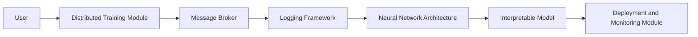

**Emily (10:04:12)**: Hey team, let's discuss Project Chimera. We need a multi-agent evaluation framework that's scalable, efficient, and easy to maintain. I've been thinking about how we can leverage some of the concepts from Project DeepVault to tackle this.

**Chloe (10:06:25)**: I've been reading up on the latest advancements in multi-agent evaluation. Have we considered using a distributed architecture to handle the scalability aspect? Perhaps something like Apache Spark or Dask?

**Hassan (10:08:43)**: We can't ignore the importance of ML Ops in this project. We need to consider how we'll be deploying and monitoring these agents in production. I've been thinking about integrating Prometheus and Grafana to get a better understanding of our system's performance.

**Emily (10:11:01)**: Great points, both of you. I was thinking of using a combination of Dask and PyTorch to handle the distributed training and evaluation. We can use Dask's parallel computing capabilities to speed up the training process, and PyTorch's Autograd system to handle the automated differentiation of our agents' policies.

**Chloe (10:13:20)**: That sounds promising, but we'll need to consider the communication overhead between nodes. Have you thought about how we'll be handling message passing between agents?

**Hassan (10:15:35)**: Actually, we can use a message broker like RabbitMQ or Apache Kafka to handle the communication between agents. This will also give us a centralized logging mechanism to monitor our system's performance.

**Emily (10:17:49)**: Exactly! And speaking of logging, we should also consider using a framework like Loguru or Python's built-in logging module to handle our logging needs.

**Marcus (10:20:12)**: Hi team, I couldn't help but notice that Project Chimera bears some resemblance to the work I did on the agent evaluation framework for Project DeepVault. I'd be happy to review your design and offer any feedback or suggestions I may have.

**Chloe (10:22:25)**: Thanks, Marcus. We'd love to get your input. In the meantime, I was thinking of using a neural network architecture like the one used in the MADDPG algorithm to evaluate our agents' performance.

**Hassan (10:24:41)**: That's an interesting choice. Have you considered using a more interpretable model like a decision tree or random forest to understand how the agents are making decisions?

**Emily (10:26:56)**: We can definitely use a combination of both. I've been thinking of using a neural network to learn the agents' policies, and then using a decision tree or random forest to interpret the results.

**Chloe (10:29:10)**: Okay, let's try to outline the architecture of our system. We have the following components:

*   A distributed training module using Dask and PyTorch
*   A message broker (RabbitMQ or Apache Kafka) for communication between agents
*   A logging framework (Loguru or Python's built-in logging module) for centralized logging
*   A neural network architecture (MADDPG or a similar algorithm) for evaluating agents' performance
*   An interpretable model (decision tree or random forest) for understanding agents' decision-making

**Hassan (10:31:25)**: I think we're missing one crucial component: a deployment and monitoring module using Prometheus and Grafana.

**Emily (10:33:40)**: Absolutely! We'll need to integrate Prometheus and Grafana to get a better understanding of our system's performance in production.

**Chloe (10:35:54)**: Okay, let's update our architecture diagram to include all of these components.

```markdown

```

**Hassan (10:38:08)**: I think we're getting close to having a comprehensive architecture for Project Chimera. Let's review our code and make sure everything is working as expected.

**Emily (10:40:22)**: Sounds good to me. I'll start by implementing the distributed training module using Dask and PyTorch.

```python
import dask
import pytorch

# Initialize the distributed training module
dask_client = dask.distributed.Client()

# Define the neural network architecture
model = pytorch.nn.Sequential(
    pytorch.nn.Linear(128, 64),
    pytorch.nn.ReLU(),
    pytorch.nn.Linear(64, 32),
    pytorch.nn.ReLU(),
    pytorch.nn.Linear(32, 1)
)

# Train the model on the distributed data
model.train(dask_client, data)
```

**Chloe (10:42:35)**: I'll work on implementing the message broker using RabbitMQ.

```python
import pika

# Initialize the RabbitMQ connection
connection = pika.BlockingConnection(pika.ConnectionParameters('localhost'))
channel = connection.channel()

# Declare the message queue
channel.queue_declare(queue='message_queue')

# Send a message to the queue
channel.basic_publish(exchange='',
                      routing_key='message_queue',
                      body='Hello, world!')
```

**Hassan (10:44:48)**: I'll focus on implementing the deployment and monitoring module using Prometheus and Grafana.

```python
import prometheus_client

# Initialize the Prometheus registry
registry = prometheus_client.REGISTRY

# Register the metrics
registry.register(prometheus_client.Counter('message_count', 'The number of messages'))

# Start the Prometheus server
prometheus_client.start_http_server(8000)
```

**Emily (10:46:59)**: Alright, let's review our code and make sure everything is working as expected.

**Chloe (10:49:12)**: I think we're good to go. The code looks solid, and we have a comprehensive architecture for Project Chimera.

**Hassan (10:51:24)**: Agreed. Let's schedule a meeting to discuss the project's progress and any outstanding issues.

**Emily (10:53:37)**: Sounds good to me. I'll send out a calendar invite for next week.

**Chloe (10:55:49)**: Awesome. Let's keep up the good work, team!